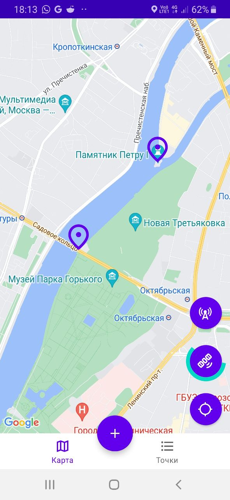
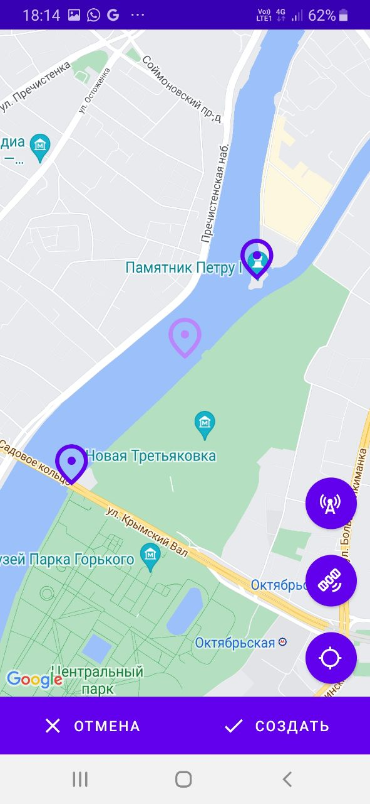
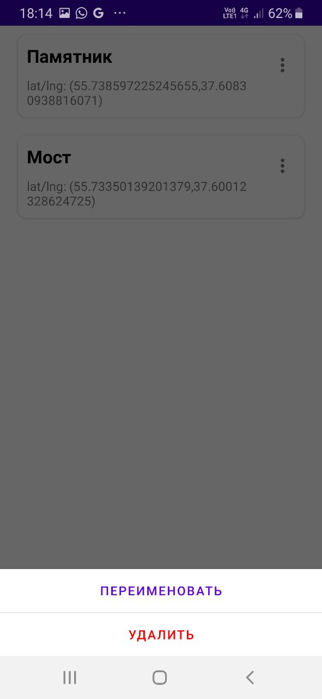

<b>
  

    Скачать: 
    <a href="https://github.com/GrishaninVyacheslav/map-and-markers/releases/download/pre-release/map_and_markers.apk">map_and_markers.apk</a>
  

  

    Стек технологий: Google Maps SDK, Room, RxJava, Dagger, ViewModel, Fragments.
  

  

    Навигация между экранами: костомная, осуществляется BottomNavigationActivity.
  

</b>
Пример приложения, использующего Google Maps API. Состоит из основного экрана в виде карты, на которой можно расставлять маркеры и дополнительного экрана со списком маркеров. Приложение может находить местоположение устройства по геолокации (GPS или Network позиционированием). Приложение реализует архитектуру MVVM с соблюдением принципов SOLID, Clean Architecture, Single Activity.

  
  
  

